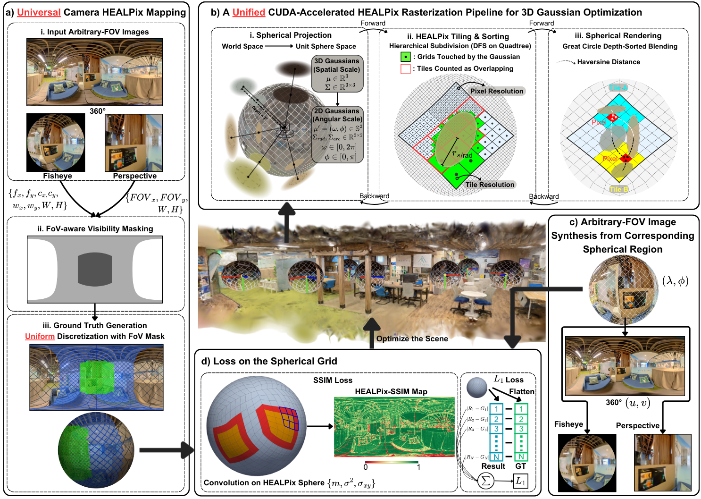

<h1 style="margin: 0;">UniTriSplat: A Unified 3D Gaussian Splatting Framework with Uniform Spherical Rasterization for Universal Cameras</h1>

  
  
  
  

The Hong Kong University of Science and Technology

Beijing Institute of Technology

The 19th European Conference on Computer Vision -- ECCV 2026

  <a href="https://scholar.google.com/citations?user=pb3sxigAAAAJ&hl=zh-CN">Yipeng Zhu</a>,
  <a href="https://huajianup.github.io/">Huajian Huang†</a>,
  <a href="https://seng.hkust.edu.hk/about/people/faculty/tristan-camille-braud">Tristan Braud</a>,
  <a href="https://saikit.org/index.html">Sai-Kit Yeung</a>

†Corresponding author

    
     
    <em>Pipeline of the UniTriSplat.</em>
      

> **Abstract:**
Existing 3D Gaussian Splatting (3DGS) frameworks rely on camera-specific rasterization, suffering from inconsistent solid-angle sampling and degraded performance across heterogeneous camera models (e.g., perspective, fisheye, omnidirectional).
To address this limitation, we propose UniTriSplat, a unified 3DGS framework for universal cameras that reformulates Gaussian splatting on the unit sphere via HEALPix discretization.
Leveraging the equal-area property of HEALPix, we construct a spherical sampling grid aligned with the angular resolution of input images. We derive the forward rendering and gradient propagation of Gaussians directly in the spherical radian domain, yielding uniform optimization behavior from narrow-FoV images to full 360-degree panoramas.
To enhance perceptual reconstruction quality, we additionally introduce a HEALPix-aware SSIM loss that respects spherical neighborhood structure.
Extensive experiments across diverse camera models demonstrate that UniTriSplat consistently improves cross-camera generalization while preserving geometric fidelity and rendering quality.

<!-- 可选：用于 badge 占位的锚点 -->

## Updates:
- 🚧 **Coming soon:** Full source code release.
- 🚧 **Coming soon:** HSSIM submodule source code release.
- 🚧 **Coming soon:** Project page.
- ✅ **2026-06-17:** UniTriSplat was accepted to ECCV 2026! 🎉
