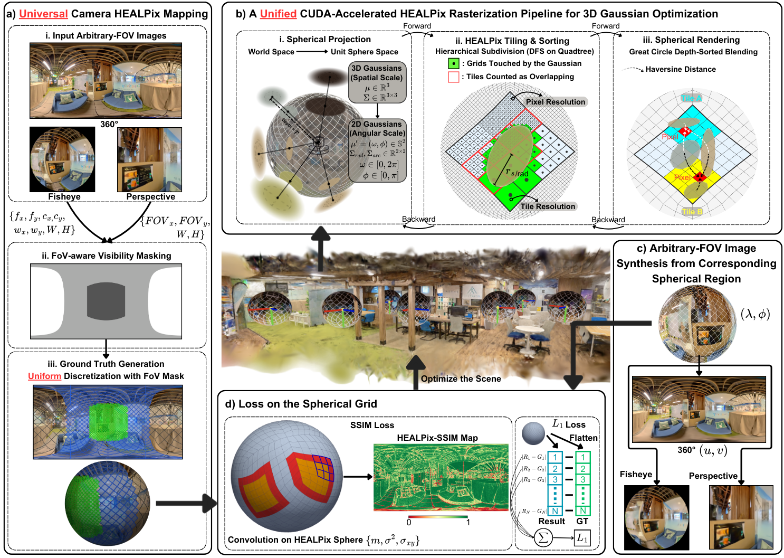

<div align="center">

<h1 style="margin: 0;">UniTriSplat: A Unified 3D Gaussian Splatting Framework with Uniform Spherical Rasterization for Universal Cameras</h1>

<p style="margin: 8px 0 2px 0;">
  <a href="docs/assets/unitrisplat-paper.pdf"></a>
  <a href="https://arxiv.org/abs/2606.29794"></a>
  <a href="https://yipengzhu0809.github.io/UniTriSplat/"></a>
  <a href="https://github.com/yipengzhu0809/healpix-ssim"></a>
</p>

<p style="margin: 6px 0 0 0;">The Hong Kong University of Science and Technology</p>
<p style="margin: 6px 0 0 0;">Beijing Institute of Technology</p>
<p style="margin: 2px 0;">The 19th European Conference on Computer Vision -- ECCV 2026</p>

<p style="margin: 6px 0 0 0;">
  <a href="https://scholar.google.com/citations?user=pb3sxigAAAAJ&hl=zh-CN">Yipeng Zhu</a>,
  <a href="https://huajianup.github.io/">Huajian Huang<sup>†</sup></a>,
  <a href="https://seng.hkust.edu.hk/about/people/faculty/tristan-camille-braud">Tristan Braud</a>,
  <a href="https://saikit.org/index.html">Sai-Kit Yeung</a>
</p>

<sup>†</sup>Corresponding author

</div>

<div align="center">
    
    <br>
    <em>Pipeline of the UniTriSplat.</em>
    <br><br>
</div>


> **Abstract:**
Existing 3D Gaussian Splatting (3DGS) frameworks rely on camera-specific rasterization, suffering from inconsistent solid-angle sampling and degraded performance across heterogeneous camera models (e.g., perspective, fisheye, omnidirectional).
To address this limitation, we propose UniTriSplat, a unified 3DGS framework for universal cameras that reformulates Gaussian splatting on the unit sphere via HEALPix discretization.
Leveraging the equal-area property of HEALPix, we construct a spherical sampling grid aligned with the angular resolution of input images. We derive the forward rendering and gradient propagation of Gaussians directly in the spherical radian domain, yielding uniform optimization behavior from narrow-FoV images to full 360-degree panoramas.
To enhance perceptual reconstruction quality, we additionally introduce a HEALPix-aware SSIM loss that respects spherical neighborhood structure.
Extensive experiments across diverse camera models demonstrate that UniTriSplat consistently improves cross-camera generalization while preserving geometric fidelity and rendering quality.

<!-- Optional anchor reserved for future badges. -->
<span id="paper"></span>
<span id="arxiv"></span>
<span id="project-page"></span>
<span id="sub-hssim"></span>

## Updates:
- ✅ **2026-07-22:** Released the foundational UniTriSplat source code, including the core training and rendering functionality. Further optimizations tailored to UniTriSplat will be introduced in future updates.
- ✅ **2026-07-20:** [HSSIM submodule source code](https://github.com/yipengzhu0809/healpix-ssim) was released.
- ✅ **2026-07-07:** The [project page](https://yipengzhu0809.github.io/UniTriSplat/) was released.
- ✅ **2026-06-17:** UniTriSplat was accepted to ECCV 2026! 🎉

## Installation

Clone the repository together with its submodules:

```bash
git clone --recursive https://github.com/yipengzhu0809/UniTriSplat.git
cd UniTriSplat
```

Create an isolated environment:

```bash
conda env create -f environment.yml
conda activate unitrisplat
```

Install the CUDA-enabled PyTorch build used by the verified release:

```bash
conda install --override-channels --strict-channel-priority \
  pytorch==2.4.1 torchvision==0.19.1 torchaudio==2.4.1 \
  pytorch-cuda=12.4 \
  -c pytorch -c nvidia -c conda-forge
```

### Reference Environment

The verified server used an NVIDIA RTX 4090 D with driver 555.42.02, CUDA
toolkit 12.5 (`nvcc` 12.5.40), GCC/G++ 11.4, Python 3.10, PyTorch 2.4.1,
torchvision 0.19.1, and the PyTorch CUDA 12.4 runtime. The PyTorch runtime and
the toolkit used to compile extensions are separate; a compatible driver,
C++ compiler, and `nvcc` are required.

If needed, follow the
[CUDA 12.5 installation guide](https://docs.nvidia.com/cuda/archive/12.5.0/cuda-installation-guide-linux/index.html).
On Ubuntu with NVIDIA's CUDA repository configured:

```bash
sudo apt -s install cuda-toolkit-12-5
sudo apt install cuda-toolkit-12-5
```

When multiple CUDA versions are installed, select CUDA 12.5 only in the build
shell:

```bash
export CUDA_HOME=/usr/local/cuda-12.5
export PATH="$CUDA_HOME/bin:$PATH"
```

Build the CUDA extensions in the same environment:

```bash
python -m pip install --no-build-isolation submodules/simple-knn
python -m pip install --no-build-isolation submodules/diff-gaussian-rasterization
python -m pip install --no-build-isolation submodules/fused-ssim
python -m pip install --no-build-isolation submodules/healpix-ssim
```

## Scripts

The main training and rendering entry points remain at the repository root.
Optional dataset-specific and HSSIM utilities are grouped under `tools/`.
Install their additional dependencies before using the ScanNet++ converter or
the evaluation and visualization utilities:

```bash
python -m pip install -r requirements-optional.txt
```

Expand an entry below for its purpose and command-line interface.

<details>
<summary><code>tools/data/convert_opencv_fisheye.py</code></summary>

Converts a calibrated COLMAP `OPENCV_FISHEYE` scene to the equidistant
fisheye convention used by UniTriSplat, preserves camera poses, and generates
training/test transforms.

```bash
python tools/data/convert_opencv_fisheye.py \
  --input_dir /path/to/opencv_fisheye_scene \
  --output_dir /path/to/converted_scene \
  --dst_width 1000 \
  --dst_height 1000 \
  --dst_fov 155 \
  --test_every 8
```

The default input subdirectories are `colmap/model/` and `images/`. Use
`--help` to inspect custom subdirectory, focal-length, split, and camera-filter
options.

</details>

<details>
<summary><code>tools/data/convert_scannetpp.py</code></summary>

Converts ScanNet++ DSLR fisheye data to the calibrated equidistant convention
while preserving scene-specific focal lengths, principal points, and poses.

```bash
python tools/data/convert_scannetpp.py \
  --input_dir /path/to/scannetpp_scene \
  --output_dir /path/to/converted_scene \
  --test_every 8
```

The default input subdirectories are `colmap/` and `resized_images/`; they can
be changed with `--colmap_subdir` and `--images_subdir`.

</details>

<details>
<summary><code>tools/evaluation/hp_metric.py</code></summary>

Projects matching equirectangular images from `renders/` and `gt/` to the
HEALPix grid and reports HSSIM, spherical PSNR, and spherical MSE.

```bash
python tools/evaluation/hp_metric.py \
  --input_dir output/scene/test/ours_30000 \
  --nside 512
```

Use `--order` instead of `--nside` to specify the HEALPix order, or `--ext`
to evaluate an image extension other than PNG.

</details>

<details>
<summary><code>tools/evaluation/visualize_hpssim.py</code></summary>

Generates per-view HSSIM maps and an aggregate summary for corresponding
images in `renders/` and `gt/`.

```bash
python tools/evaluation/visualize_hpssim.py \
  --input_dir output/scene/test/ours_30000 \
  --output_dir output/scene/test/ours_30000/hpssim_viz \
  --nside 512 \
  --device cuda
```

The output directory defaults to `<input_dir>/hpssim_viz`. Add `--flip` when
a 180-degree longitude shift is needed for visualization.

</details>

## Data Preparation

Select the input camera with `--camera_model`: `0` for perspective, `1` for
fisheye, and `2` for omnidirectional images.

### Perspective and omnidirectional data

Prepare perspective data in the standard 3DGS/COLMAP layout. COLMAP pinhole
intrinsics determine the perspective FoV, so distorted images must be
undistorted before training. NeRF-synthetic-style transforms are also supported.
For omnidirectional data, provide equirectangular images and the corresponding
camera poses in the transforms files.

### Fisheye projection convention

UniTriSplat trains fisheye scenes with an equidistant projection and supports
independent horizontal and vertical angular coverage. A calibrated scene should
store these fields in both `transforms_train.json` and
`transforms_test.json`:

- `fisheye_fx`, `fisheye_fy`: focal lengths in pixels.
- `fisheye_cx`, `fisheye_cy`: principal point in pixels.
- `fisheye_w_x`, `fisheye_w_y`: axis FoV scales, where `1.0` represents
  180 degrees.
- `fisheye_width`, `fisheye_height`: image dimensions for which the
  calibration is valid.

The conversion utilities preserve camera poses, remap source images with
inverse projection and bilinear sampling, create an `images/` directory, split
the registered views, and write the two transforms files. UniTriSplat then loads
the generated calibration automatically.

### Generic calibrated fisheye conversion

`tools/data/convert_opencv_fisheye.py` expects registered COLMAP
`OPENCV_FISHEYE` intrinsics (`fx fy cx cy k1 k2 k3 k4`). Its default input
layout is:

```text
scene/
  colmap/model/cameras.{txt,bin}
  colmap/model/images.{txt,bin}
  images/
```

Convert the distorted source images to a centered equidistant target:

```bash
python tools/data/convert_opencv_fisheye.py \
  --input_dir /path/to/opencv_fisheye_scene \
  --output_dir /path/to/converted_scene \
  --dst_width 1000 \
  --dst_height 1000 \
  --dst_fov 140 \
  --test_every 8
```

`--dst_fov` is the target FoV on both axes. Unless `--dst_fx` and
`--dst_fy` are supplied, the converter uses `fx = width / pi`,
`fy = height / pi`, and a centered principal point. Use
`--colmap_subdir` or `--images_subdir` for a different layout,
`--camera_prefix` to select one camera stream, and either `--test_every N`
or `--test_ratio` to control the split. `--no_convert` only links the
original images and ignores `k1` through `k4`; it is an approximation and
should not be used when lens distortion is significant.

### ScanNet++ fisheye conversion

`tools/data/convert_scannetpp.py` handles the ScanNet++ DSLR fisheye layout,
whose defaults are `colmap/` and `resized_images/`:

```bash
python tools/data/convert_scannetpp.py \
  --input_dir /path/to/scannetpp_scene \
  --output_dir /path/to/scannetpp_equidistant \
  --test_every 8
```

This converter keeps the source resolution and calibrated principal point. It
inverts the source `OPENCV_FISHEYE` distortion at the horizontal and vertical
image boundaries, then selects equidistant `fx` and `fy` that preserve those
incidence angles. This is important for off-center or asymmetric calibration;
do not replace the generated values with centered FoV overrides. SciPy is
required by this converter and is included in `requirements-optional.txt`.

Both converters produce:

```text
converted_scene/
  images/
  transforms_train.json
  transforms_test.json
```

Check that the reported train/test counts are nonzero, inspect several converted
images for black borders or unexpected cropping, and verify that the image
dimensions match `fisheye_width` and `fisheye_height` before starting a long
training run.

For already-normalized, centered equidistant images without calibration
metadata, pass both `--fisheye_fov_x` and `--fisheye_fov_y` in degrees.
UniTriSplat then derives `fx = W / pi`, `fy = H / pi`, `cx = W / 2`,
`cy = H / 2`, `w_x = FoV_x / 180`, and `w_y = FoV_y / 180`. These
arguments override transforms metadata, so use them only when the images follow
this centered projection.

## Parameter Notes

- **Query mode:** The NESTED quadtree query is enabled by default. Add
  `--use_ring` for faster execution and lower auxiliary GPU-memory usage,
  with a possible small reduction in overlap accuracy.
- **Memory:** `--data_device cpu` is the default. High-resolution or
  large-view datasets can still require substantial host memory.
- **HEALPix resolution:** `--healpix_scale` controls training resolution and
  `--healpix_scale_test` controls evaluation resolution. Lower these values
  when training is slow or GPU-memory usage is high; higher values preserve
  more angular detail.
- **Optimization:** HEALPix-domain gradients differ from planar-image
  gradients. Tune `--densify_grad_threshold`, `--position_lr_init`, and
  `--position_lr_final` for each dataset.

## Training

The following examples cover the supported camera models. Their optimization
values are starting points and should be tuned for a new dataset.

### Perspective camera

```bash
CUDA_VISIBLE_DEVICES=0 python train.py \
  -s /path/to/perspective_scene \
  -m output/perspective_scene \
  --camera_model 0 \
  --healpix_scale -2 \
  --healpix_scale_test -1 \
  --eval -r 4 --disable_viewer \
  --densify_grad_threshold 0.00075 \
  --position_lr_init 0.005 \
  --position_lr_final 0.0000016 \
  --rotation_lr 0.005
```

Perspective FoVs are derived from dataset intrinsics. `--perspective_fov` is
only used by `render.py` for a custom output FoV.

### Calibrated fisheye camera

```bash
CUDA_VISIBLE_DEVICES=0 python train.py \
  -s /path/to/converted_fisheye_scene \
  -m output/calibrated_fisheye_scene \
  --camera_model 1 \
  --healpix_scale -1 \
  --healpix_scale_test -1 \
  --eval -r 1 --disable_viewer \
  --densify_grad_threshold 0.00005 \
  --position_lr_init 0.005 \
  --position_lr_final 0.0000016 \
  --rotation_lr 0.005
```

No intrinsic arguments are needed when the transforms files contain the full
fisheye calibration.

### Centered fisheye camera with explicit FoV

```bash
CUDA_VISIBLE_DEVICES=0 python train.py \
  -s /path/to/centered_fisheye_scene \
  -m output/centered_fisheye_scene \
  --camera_model 1 \
  --fisheye_fov_x 140 \
  --fisheye_fov_y 140 \
  --healpix_scale -1 \
  --healpix_scale_test -1 \
  --eval -r 1 --disable_viewer \
  --densify_grad_threshold 0.000075 \
  --position_lr_init 0.005 \
  --position_lr_final 0.0000016 \
  --rotation_lr 0.005
```

### Omnidirectional camera

```bash
CUDA_VISIBLE_DEVICES=0 python train.py \
  -s /path/to/omnidirectional_scene \
  -m output/omnidirectional_scene \
  --camera_model 2 \
  --healpix_scale 0 \
  --healpix_scale_test 0 \
  --use_ring \
  --eval -r 1 --disable_viewer \
  --densify_grad_threshold 0.00005 \
  --position_lr_init 0.003 \
  --position_lr_final 0.000016 \
  --opacity_lr 0.05
```

## Rendering

`render.py` loads the saved training configuration from `cfg_args`. Set
`--healpix_scale` to the desired rendering resolution.

### Perspective camera

```bash
python render.py \
  -s /path/to/perspective_scene \
  -m output/perspective_scene \
  --iteration 30000 \
  --skip_train \
  --camera_model 0 \
  --healpix_scale -1 \
  --perspective_fov 60 \
  --perspective_width 800 \
  --perspective_height 600
```

### Fisheye camera

```bash
python render.py \
  -s /path/to/fisheye_scene \
  -m output/fisheye_scene \
  --iteration 30000 \
  --skip_train \
  --camera_model 1 \
  --healpix_scale -1
```

Fisheye calibration is loaded from the dataset transforms or from explicit FoVs
saved during training. Optional `--fisheye_width` and `--fisheye_height`
arguments change the output resolution.

### Omnidirectional camera

```bash
python render.py \
  -s /path/to/omnidirectional_scene \
  -m output/omnidirectional_scene \
  --iteration 30000 \
  --skip_train \
  --camera_model 2 \
  --healpix_scale 0
```

## License

UniTriSplat is built on the
[original 3D Gaussian Splatting codebase](https://github.com/graphdeco-inria/gaussian-splatting).
Files derived from that project remain subject to the terms in
[`LICENSE_3DGS.md`](LICENSE_3DGS.md). The
[HSSIM implementation](https://github.com/yipengzhu0809/healpix-ssim) is
included as a git submodule and retains its own license notice, as do other
third-party components. The repository-level MIT license applies only to
original material for which the UniTriSplat authors hold the necessary rights.

## Citation

```bibtex
@inproceedings{zhu2026unitrisplat,
  title={UniTriSplat: A Unified 3D Gaussian Splatting Framework with Uniform Spherical Rasterization for Universal Cameras},
  author={Zhu, Yipeng and Huang, Huajian and Braud, Tristan and Yeung, Sai-Kit},
  booktitle={European Conference on Computer Vision (ECCV)},
  year={2026},
  note={Accepted. Preprint available at arXiv:2606.29794},
  url={https://arxiv.org/abs/2606.29794}
}
```
